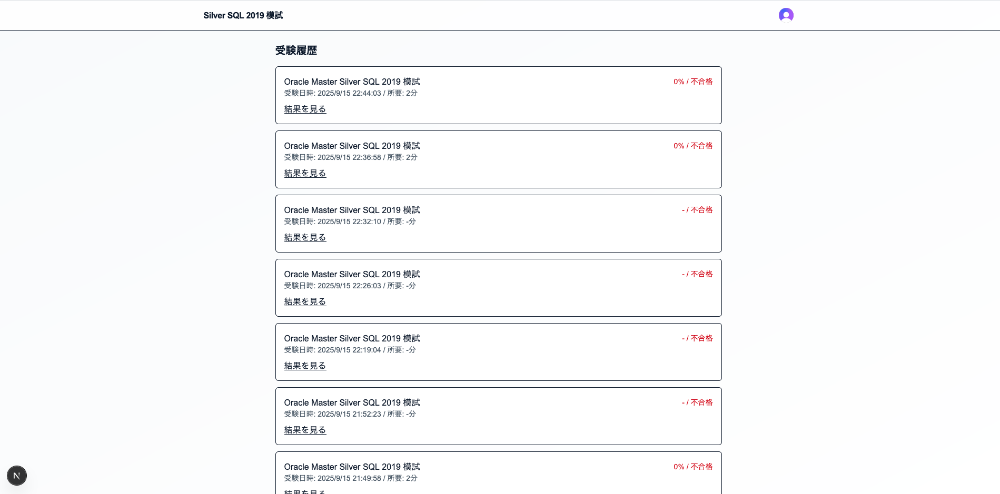
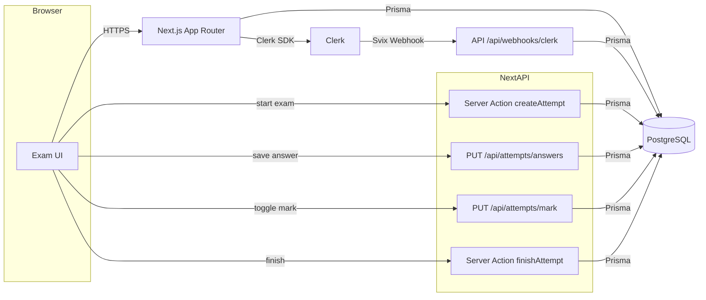
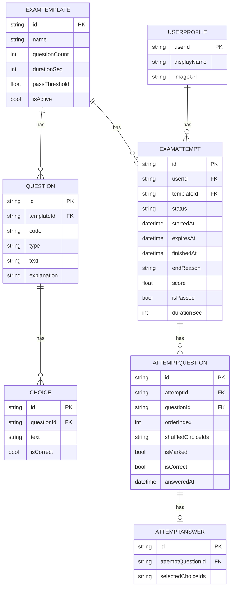

# Oracle Master Silver SQL 2019 Mock App

Oracle Master Silver SQL 2019模擬試験Webアプリケーションです。Clerkによる認証、Prisma, PostgreSQL(Supabase Database)による永続化を採用し、実際のCBT体験に近い受験フロー(120分 / 78問 / 合格63%)を提供します。

## 開発の経緯

自分が、ORACLE MASTER Silver SQL 2019のCBTを受験した際、試験の操作に戸惑って十分に実力を発揮できませんでした。
こうした経験から、在学生が操作で迷わず問題に集中できる環境を用意し、本番での正答率をより高めてもらう事を目的に、本番のCBTと近い操作感の模擬試験アプリを開発しました。

## 主な機能

- 認証: Clerk ログイン/ログアウト(未ログインは`/sign-in`に誘導)。
- Webhook同期: `user.created/updated/deleted`をSvix署名検証の上で受信し、`UserProfile`を upsert/delete。
- 試験フロー:
  - 78問 / 120分 / 合格63%
  - 単一選択(SINGLE) / 複数選択(MULTI)
  - 見直しフラグ(トグル、一覧ページからジャンプ)
  - サマリー(1〜78のグリッド：未回答/回答済/見直し)
  - タイマー(残り時間表示)
  - 時間切れ後は回答や見直し不可、「終了して採点」のみ有効
  - 途中終了も可能(その時点で採点)
  - 結果(スコア/合否/誤答番号) → 復習ページ(自分の回答・正解・解説)
- 履歴: 受験履歴一覧(日時/スコア/合否/所要時間)。

## 主要な画面

- `/`: ホーム(プロフィール、開始ボタン、履歴リンク)
- `/history`: 受験履歴
- `/exam/start`: 受験開始
- `/exam/[attemptId]/question/[index]`: 問題画面(前/次、見直し、サマリー、終了)
- `/exam/[attemptId]/summary`: サマリー
- `/exam/[attemptId]/review`: 見直し一覧
- `/exam/[attemptId]/result`: 結果
- `/exam/[attemptId]/[orderIndex]`: 復習(自分の回答・正解・解説)

## スクリーンショット

- ホーム画面


- 受験開始画面


- 問題画面


- サマリー画面


-  結果画面


- 受験履歴画面


## 使用技術

### フロントエンド

- 言語: TypeScript
- フレームワーク: Next.js 15.5(App Router)
- スタイル: tailwind

### バックエンド

- 言語: TypeScript
- フレームワーク: Next.js 15.5(App Router)
- データベース: PostgreSQL(Supabase Database)
- ORM: Prisma
- 認証: Clerk

### 開発環境・インフラ
- IDE: Visual Studio Code
- バージョン管理: Git, GitHub

## 必要要件

- Node.js 18+(推奨 20+)
- PostgreSQL 接続先(例: Supabase)
- Clerk プロジェクト(Publishable/Secret Key、Webhook Secret)


## 環境変数 (.env.local)

```
# Supabase
NEXT_PUBLIC_SUPABASE_URL=...               # プロジェクトURL
NEXT_PUBLIC_SUPABASE_PUBLISHABLE_KEY=...   # クライアント公開キー
SUPABASE_SECRET_KEY=...                    # サーバ用シークレット

# DB 接続
DATABASE_URL=postgresql://...

# Clerk
NEXT_PUBLIC_CLERK_PUBLISHABLE_KEY=...
CLERK_SECRET_KEY=...

# Clerk Webhook
CLERK_WEBHOOK_SECRET=...
```

## セットアップ

1) 依存関係のインストール

```
npm install
```

2) Prisma クライアント生成 + マイグレーション

```
npm run prisma:generate
npm run prisma:migrate
```

3) 開発サーバーの起動(Webpack 推奨)

```
npm run dev:webpack
```

4) サーバー起動後、http://localhost:3000 でアプリにアクセスできます。

※ データ投入は、Supabase SQLエディタ等で行ってください(テンプレ・設問・選択肢のレコード作成)。

## 運用手順(Ops)

- 初期セットアップ
  - `.env.local`を設定(上記の環境変数)。
  - `npm install && npx prisma migrate dev && npx prisma generate`
  - ClerkでWebhookを登録(`/api/webhooks/clerk`)。
- 本番ビルド/起動
  - `npm run build:webpack` → `npm run start`
  - 逆プロキシ配下の場合は、`x-forwarded-*`ヘッダの継承を確認。
- データバックアップ/リストア
  - バックアップ: `pg_dump "$DATABASE_URL" > backup.sql`
  - リストア: `psql "$DATABASE_URL" < backup.sql`
- セキュリティ
  - `SUPABASE_SECRET_KEY`はサーバーのみで利用。
  - API/Server Actionは、`attempt.userId === currentUserId`を常に検証。
  - 締切判定はサーバーが最終権威(期限超過は 409/ロック)。

## アーキテクチャ



## ER図



## 開発にあたって工夫した点

- サーバー起点の締切判定・APIガード・UIロックによる二重操作と不正の禁止  
サーバ側で回答時間の超過を判定するようにし、締切超過や試験終了後の回答/見直しAPIをHTTP 409で拒否するようにしました。また、クライアントUIも連動してロックされるようにしています。Server Action/APIでは、該当の設問が現在のユーザーに紐づくかを確認するように徹底しました。
これらの工夫により、二重操作や不正を行えるといった課題を解決することができました。
- ユーザー同期  
Clerk Webhookを使用して、ユーザーが作成されたときに、自動でDBにユーザーが保存されるようにしました。また、Svix検証を行うように実装し、正しいリクエストのみ受けとるようにしました。

- 動的ルーティングによる整合性と安定性  
Next.js App Routerの動的ルーティングを使用することによって、設問ページをリロードしても同じ設問に戻れる、権限チェックを設問単位で確実にできるなど、整合性と安全性が大きく向上しました。

## 今後の展望

今後の展望アイデアは以下の通りです。

1. 受験体験・学習支援
    - 不正解・未解答のみ出題／分野別復習／スコア推移表示など復習モードの拡充。
    - 分野タグごとの正答率を表示し、弱点を分析。

2. 試験運用・コンテンツ管理
    - CSV/Excelインポート/エクスポートによる問題一括登録。

3. 可視化・分析
    - 受験数、合格率、平均所要時間、問題別正答率を表示し、管理ダッシュボードの強化。
