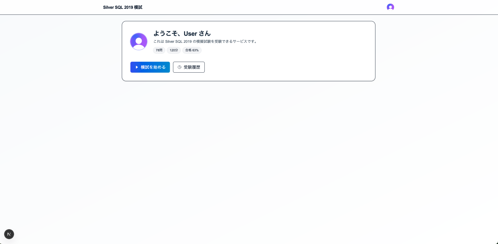
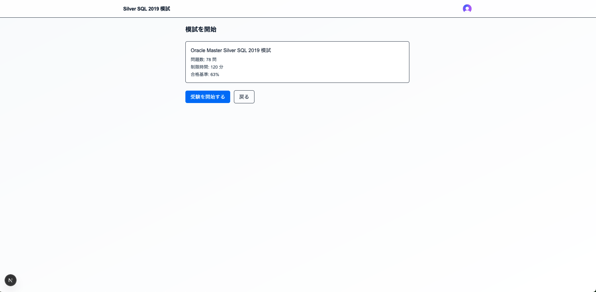
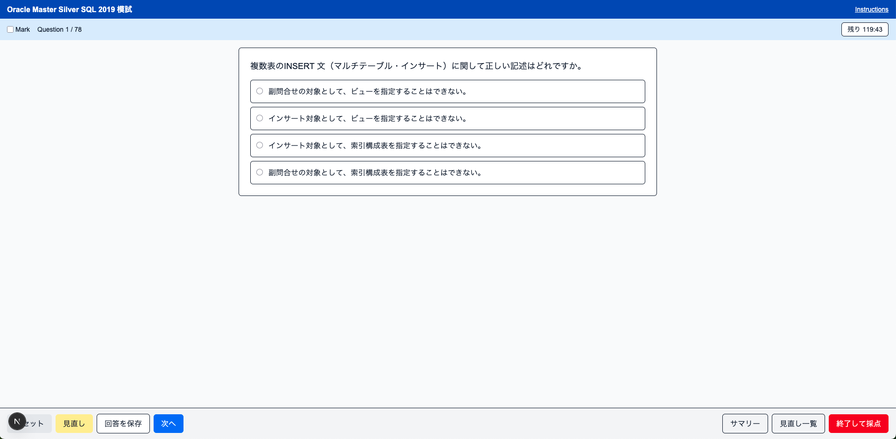
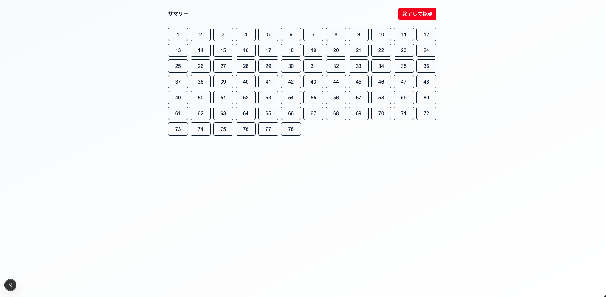
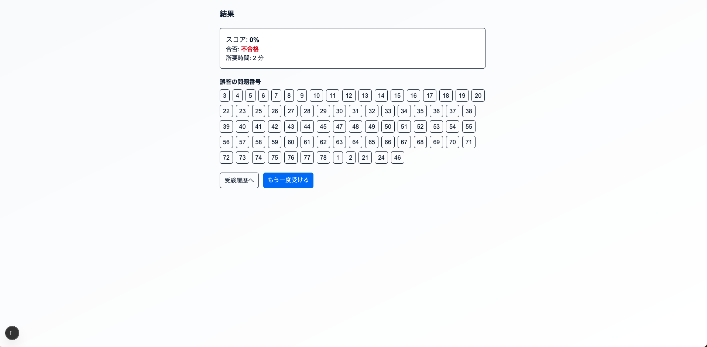
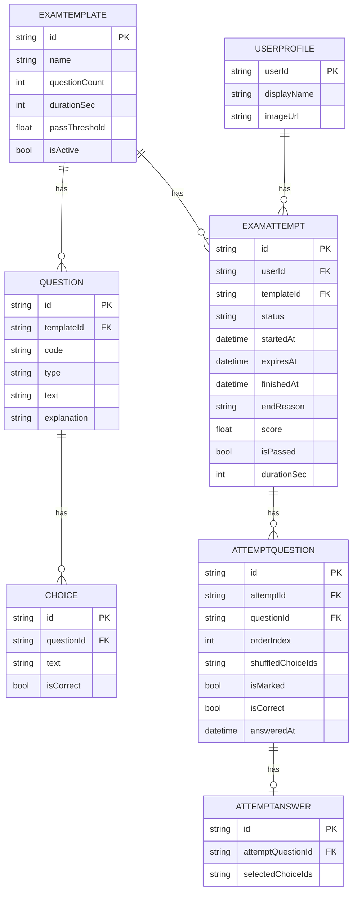

# Oracle Master Silver SQL 2019 模擬試験アプリ (Next.js)

教室の例ではなく、このリポジトリの実装に沿った「Silver SQL 2019 模擬試験」用の Web アプリです。Clerk による認証、Prisma + PostgreSQL（例: Supabase）による永続化を採用し、実際の CBT 体験に近い受験フロー（120分 / 78問 / 合格63%）を提供します。


## 主な機能

- 認証: Clerk ログイン/ログアウト（未ログインは `/sign-in` に誘導）
- Webhook 同期: `user.created/updated/deleted` を Svix 署名検証の上で受信し、`UserProfile` を upsert/delete
- 試験フロー:
  - 78問 / 120分 / 合格63%
  - 単一選択（SINGLE）/ 複数選択（MULTI）
  - 見直しフラグ（トグル、一覧ページからジャンプ）
  - サマリー（1〜78のグリッド：未回答/回答済/見直し）
  - タイマー（残り時間表示）
  - 時間切れ後は回答や見直し不可、「終了して採点」のみ有効
  - 途中終了も可能（その時点で採点）
  - 結果（スコア/合否/誤答番号）→ 復習ページ（自分の回答・正解・解説）
- 履歴: 受験履歴一覧（日時/スコア/合否/所要時間）


## 技術スタック

- Next.js 15 / React 19（App Router, Server Components）
- TypeScript / Tailwind CSS v4（PostCSS）
- Prisma / PostgreSQL（例: Supabase）
- Clerk（認証）/ Svix（Webhook 署名検証）


## 必要要件

- Node.js 18+（推奨 20+）
- PostgreSQL 接続先（例: Supabase）
- Clerk プロジェクト（Publishable/Secret Key、Webhook Secret）


## 環境変数 (.env.local)

```dotenv
# ===== Supabase（任意・例） =====
NEXT_PUBLIC_SUPABASE_URL=https://xxxxxx.supabase.co
NEXT_PUBLIC_SUPABASE_PUBLISHABLE_KEY=sb_publishable_...
SUPABASE_SECRET_KEY=sb_secret_...           # サーバ専用・絶対に公開しない

# ===== DB 接続（Prisma 用 Postgres URL）=====
# pgbouncer(6543) 推奨。<PASSWORD>/<HOST> は実環境に合わせて置換
DATABASE_URL="postgresql://postgres:<PASSWORD>@db.<HOST>.supabase.co:6543/postgres?pgbouncer=true&connection_limit=1&sslmode=require"
# マイグレーション直結用（5432）
DIRECT_URL="postgresql://postgres:<PASSWORD>@db.<HOST>.supabase.co:5432/postgres?sslmode=require"

# ===== Clerk =====
NEXT_PUBLIC_CLERK_PUBLISHABLE_KEY=pk_test_xxx
CLERK_SECRET_KEY=sk_test_xxx

# ===== Clerk Webhook Secret =====
CLERK_WEBHOOK_SECRET=whsec_xxx
```

注意: `SUPABASE_SECRET_KEY`（service_role）はサーバーのみで使用。クライアントに渡さないでください。


## セットアップ

```bash
# 1) 依存関係
npm install

# 2) Prisma マイグレーション & クライアント生成
npx prisma migrate dev --name init
npx prisma generate

# 3) Clerk Webhook を登録
#   - Endpoint: https://<your-domain>/api/webhooks/clerk
#   - Events: user.created, user.updated, user.deleted
#   - Secret: .env.local の CLERK_WEBHOOK_SECRET と一致

# 4) 開発サーバ起動
npm run dev
# http://localhost:3000 → 未ログインなら /sign-in へ
```

データ投入は Supabase SQL エディタ等で行ってください（テンプレ・設問・選択肢のレコード作成）。


## スクリーンショット

```md
### ホーム


### 受験開始（スタート）


### 問題画面（タイマー・見直し）


### サマリー（回答状況グリッド）


### 結果


### 復習（自分の回答・正解・解説）

```


## アーキテクチャ

```mermaid
flowchart LR
  subgraph Browser
    UI[Exam UI]
  end

  UI --> NEXT[Next.js (App Router)]
  NEXT --> DB[(PostgreSQL/Supabase)]
  NEXT --> CLERK[Clerk]
  CLERK --> WEBHOOK[/api/webhooks/clerk]

  subgraph ExamFlow
    SA1[Server Action: createAttempt]
    SA2[Server Action: finishAttempt]
  end

  NEXT -.-> DB
  NEXT -.-> CLERK
```


## ER 図（論理）




## 運用手順（Ops）

- 初期セットアップ
  - `.env.local` を設定（上記の環境変数）
  - `npm install && npx prisma migrate dev && npx prisma generate`
  - Clerk で Webhook を登録（`/api/webhooks/clerk`）
- 本番ビルド/起動
  - `npm run build` → `npm run start`
  - 逆プロキシ配下の場合は `x-forwarded-*` ヘッダの継承を確認
- データバックアップ/リストア
  - バックアップ: `pg_dump "$DATABASE_URL" > backup.sql`
  - リストア: `psql "$DATABASE_URL" < backup.sql`
- セキュリティ
  - `SUPABASE_SECRET_KEY` はサーバーのみで利用（公開しない）
  - API/Server Action は `attempt.userId === currentUserId` を常に検証
  - 締切判定はサーバーが最終権威（期限超過は 409/ロック）


## 主要な画面

- `/` ホーム（プロフィール、開始ボタン、履歴リンク）
- `/history` 受験履歴
- `/exam/start` 受験開始
- `/exam/[attemptId]/question/[index]` 問題画面（前/次、見直し、サマリー、終了）
- `/exam/[attemptId]/summary` サマリー
- `/exam/[attemptId]/review` 見直し一覧
- `/exam/[attemptId]/result` 結果
- `/exam/[attemptId]/[orderIndex]` 復習（自分の回答・正解・解説）


## API 一覧（抜粋）

- POST `/api/webhooks/clerk`（Clerk Webhook, Svix 検証）
  - `user.created/updated` → `UserProfile` upsert
  - `user.deleted` → `UserProfile` deleteMany
- PUT `/api/attempts/answers`
  - JSON: `{ attemptQuestionId: string, selectedChoiceIds: string[] }`
  - 締切チェック（`now <= expiresAt && status=IN_PROGRESS`）OK のときのみ Upsert
- PUT `/api/attempts/mark`
  - JSON: `{ attemptQuestionId: string, next: boolean }`
  - 見直しフラグのトグル（締切チェックあり）
- Server Action
  - `createAttempt({ userId, templateId })`
  - `finishAttempt({ attemptId, end: 'USER_FINISH' | 'TIMEOUT' })`


## ライセンス

MIT License
